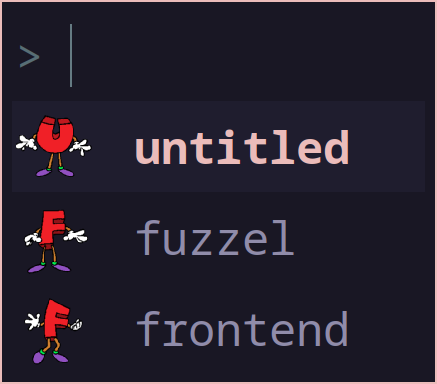

# uff: untitled fuzzel frontend

[](https://crates.io/crates/uff_cli)




## feature comparison
uff is strongly inspired by [raffi](https://github.com/chmouel/raffi/).
|                            | **uff** | **raffi** |
| :------------------------: | :-----: | :-------: |
|         **icons**          | **yes** |  **yes**  |
|        **submenus**        | **yes** |    no     |
|    **custom icon dirs**    | **yes** |    no     |
|  **per-menu fuzzel args**  | **yes** |    no     |
| **per-menu fuzzel config** | **yes** |    no     |
|     **inline scripts**     |   no    |  **yes**  |
|   **conditional items**    |   no    |  **yes**  |

## installation + setup

```bash
cargo install --locked uff_cli
mkdir ~/.config/uff/
$EDITOR ~/.config/uff/default.kdl
# see below section for the config format
```

## configuration
```kdl
fuzzel-args foo bar baz

fuzzel-config {
    key value
}
// ^ inherited by submenus

icon-dir "/etc/whatever"
// ^ can be repeated for more dirs, inherited by submenus
// ^ also searches in XDG_DATA_DIRS by default

program "display name" {
    command foo bar baz
    // ^ required
    icon name
    // ^ will search the icon dirs for name.png or name.svg
    // ^ can also be a full path to the icon
}

menu "nested submenu" {
    icon name
    // submenus can contain all of the above items, plus an optional icon
}
```

## license

licensed under either of

 * Apache License, Version 2.0
   ([LICENSE-APACHE](LICENSE-APACHE) or <http://www.apache.org/licenses/LICENSE-2.0>)
 * MIT license
   ([LICENSE-MIT](LICENSE-MIT) or <http://opensource.org/licenses/MIT>)

at your option.

## lontribution

unless you explicitly state otherwise, any contribution intentionally submitted
for inclusion in the work by you, as defined in the Apache-2.0 license, shall be
dual licensed as above, without any additional terms or conditions.
